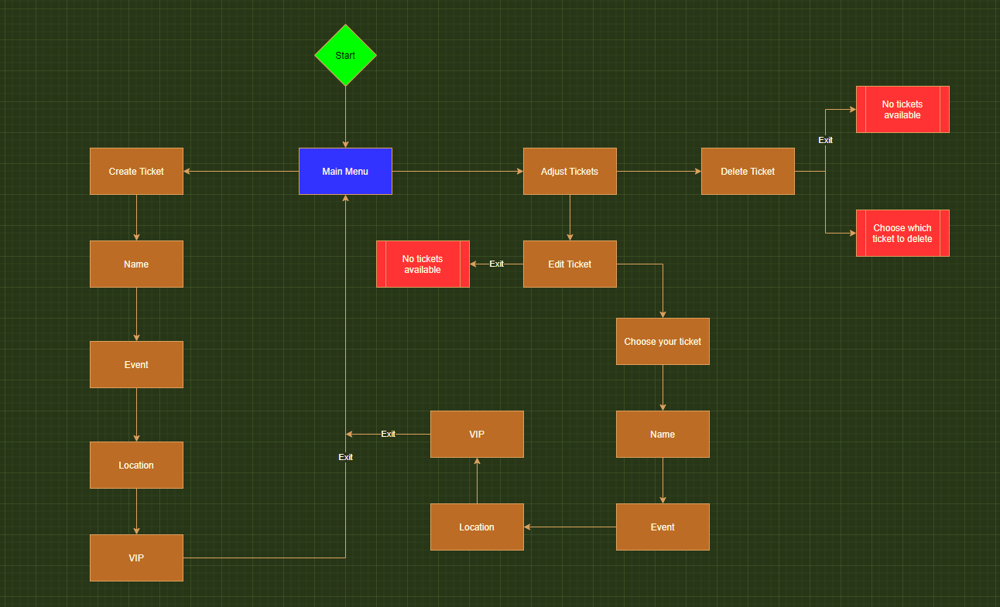
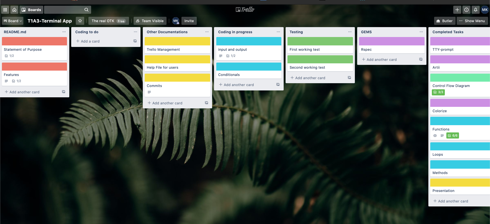

# T1A2 - Ruby Terminal App
## by Muhammed Khan

---

## Source Control Repository

My GitHub repository for the project can be found at the link below:

https://github.com/MTayyebKhan/T1A3_Terminal_App.git

## Software Development Plan

### Purpose

The reasoning behind my ruby terminal application is to copy the behaviour of a booking app. Example of this would be when you buy a movie ticket online with the option of adding popcorn and drink with your ticket and where you wish to sit along with being in gold class.

At a high level, the application intends on functioning as an app on your phone like ticketek, something that can be easier and more effiecient to use.

My prior experience working for a cinema dealing with tickets for customers gave me this idea of how can we make an app to produce your ticket that you can bring to the foodary and pay and move on, instead of lining up for a ticket, then lining up for food. Solving this problem saves money for the business as well as saving time for the customer.

So here I present to you is Event tickets, targetted towards cinema business owners aswell as customers who wish to fly through, or make a quick decision on watching a movie.

### Scope

The scope of my terminal application is for event tickets to provide the following core features:
- Buy a Ticket
- Adjust/Edit Tickets
- Cancellation of Tickets
- Receipt

I am confident that I was able to deliver each of these primary features, though many others that I had originally intended to complete did not make the cut.

As this was my first experience developing a terminal application, it was difficult for me to gauge how quickly I was able to complete certain tasks I had set. I am however pleased with what I have produced within only a week.

This assignment is a real skill test of my capabilities at this time of my coding journey.

## Feature Details & Outline

The program features the following features:

- Buy a Ticket
  - The user is prompted to buy a ticket, this method utilises a Ruby class and several connecting parsing methods and variables to generate a result in an empty array
  
  - The user is asked to enter there name with an example of how to enter there name. Buying a ticket involves the user to input a valid string entry followed by menu options prompting what event they wish to book, where they would like to be seated and weather they want a VIP service or not. This is similar to how the user is prompted at the beginning of the application to either buy or edit a ticket.

- Edit Ticket
  - The user is able to adjust there selection buy editing there tickets and overwriting the tickets atrributes. Exception handling is implemented to make certain there is a ticket that can editing via checking if there is anything within the array first.
  - The user can then interact with their ticket by a prompt on screen similar to buying a ticket functionality. Users will be prompted to select a ticket via the menu prompt and selecting which ticket attribute they'd like to change, with user input also managed in the same fashion.
- Cancellation of ticket
  - The user is able to cancel existing tickets to remove the ticket element from the array of total tickets. Exception handling is implemented to ensure validity of data, where the user is unable to initiate the ticket delete method if there are no existing tickets.
  - User interaction and error handling are handled identically to the ticket editing method, where the program will consider if the ticket listing is empty before proceeding with the deletion of at item.

- Receipt 
  - The user will be given a receipt of there product at the end of choosing their attributes in creating a ticket to show what they are going to purhase.
  - The user will also get an updated receipt after editing aswell to have the same effect as buying a new ticket.

## Application Flow Diagram

Please find a link to my application flow diagram:



## Project Management Plan (Trello)

Here is a screenshot of my Trello plan:



As well as a link:

https://trello.com/b/Jvjqmjau/t1a3-terminal-app

## User Documentation

### Instructions for install

To install the latest version of Ruby on your computer, following the instructions at the link below:

https://www.ruby-lang.org/en/documentation/installation/

Then, follow the below steps:

1. Download the application files through the Github link source provided earlier, posted below for convenience:

https://github.com/MTayyebKhan/T1A3_Terminal_App.git

2. Open your terminal and navigate to the directory that the files were cloned to

3. Run the command below command in your terminal

```
bundle
``` 

4. Navigate to the src subfolder, then run the below command in your terminal 

```
./shell.sh
```

5. If it does not work give shell.sh executing privileges

```
chmod +x shell.sh
```

&copy; Muhammed Khan